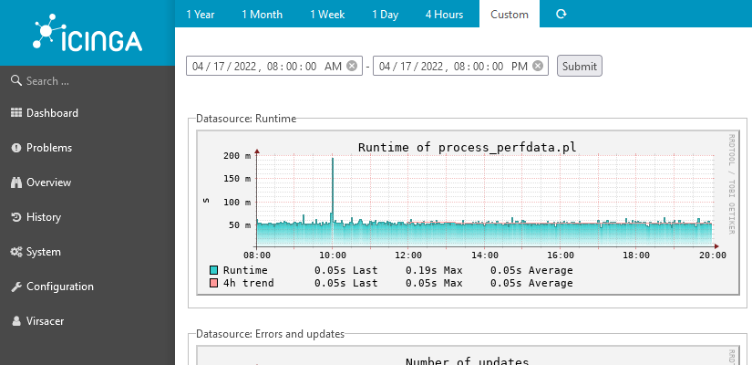
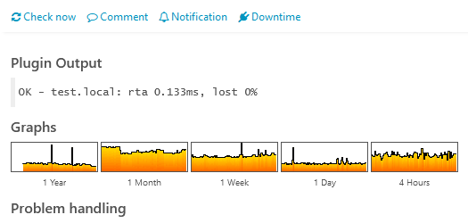

# rrdtool module for Icinga Web 2

## About

This module is a replacement for pnp4nagios.

It uses `rrdtool` to store perfdata (from Icinga2 PerfdataWriter) in RRDs and to generate graphs from RRDs.

## License

Icinga Web 2 and this Icinga Web 2 module are licensed under the terms of the GNU General Public License Version 2, you will find a copy of this license in the LICENSE file included in the source package.

## Requirements

This module requires Icinga Web 2 (>= 2.9.0) and the PHP RRD-extension (highly recommended) or the rrdtool-binaries.

Fast storage: Writing a lot of RRD files also requres a lot of IO.

## Installation

Extract this module to your Icinga Web 2 modules directory as `rrdtool` directory.

Additional pnp4nagios-templates should be compatible and can be placed in the `templates` directory.

## Configuration

### Icinga2

To enable the PerfdataWriter you need to run `icinga2 feature enable perfdata`.

You can set the `rotation_interval` a little lower to have less perfdata waiting for the next processing run.

When you use checkcommands like `nrpe`, that actually call other commands, you can add a customvar like `rrdtool` to your services and append it to the checkcommand in your perfdata to allow differentiation:

    object PerfdataWriter "perfdata" {
    	rotation_interval = 10s
    	service_format_template = "DATATYPE::SERVICEPERFDATA\tTIMET::$service.last_check$\tHOSTNAME::$host.name$\tSERVICEDESC::$service.name$\tSERVICEPERFDATA::$service.perfdata$\tSERVICECHECKCOMMAND::$service.check_command$$rrdtool$\tHOSTSTATE::$host.state$\tHOSTSTATETYPE::$host.state_type$\tSERVICESTATE::$service.state$\tSERVICESTATETYPE::$service.state_type$"
    }

### Module

To be able to render the graphs, PHP and/or the webserver needs the permission to read the RRD and XML files. A check is included in the configuration page.

After the module has been configured, you can set up a cronjob running the command `icingacli rrdtool process` every minute to generate/update the RRDs. The user needs the permission to write the RRD and XML files.

If you need to process lots of perfdata, you can use `icingacli rrdtool process bulk` for bulk mode. Make sure only one processing-instance is running at a time.

By default all perfdata of a service is written to a single RRD. To be able to update the file, the number of datasources must not change.

On some checks it might be expected that this number changes over time. You can configure these checkcommands to use a dedicated RRD for each datasource.

Example: A check that lists all disks or partitions. When each is in a separate file they can be updated independently. So adding or removing disks/partition does not prevent the update.

## CLI

This module also provides CLI commands. For a list of commands run `icingacli rrdtool`.

You can export graphs with various parameters. See `icingacli rrdtool graph --help` for details.

The values for `size` and `range` are also valid in URLs. Example: `/rrdtool/graph?1500*200&host=.pnp-internal&range=2023`
