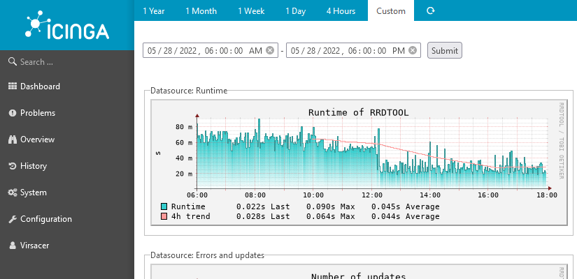

# rrdtool module for Icinga Web 2

## About

This module generates rrdtool-graphs from pnp4nagios-data.

## License

Icinga Web 2 and this Icinga Web 2 module are licensed under the terms of the GNU General Public License Version 2, you will find a copy of this license in the LICENSE file included in the source package.

## Requirements

This module requires Icinga Web 2 (>= 2.9.0) and the PHP RRD-extension (recommended) or the rrdtool-binaries.

## Installation

Extract this module to your Icinga Web 2 modules directory as `rrdtool` directory.

Additional pnp4nagios-templates should be compatible and can be placed in the `templates` directory.
